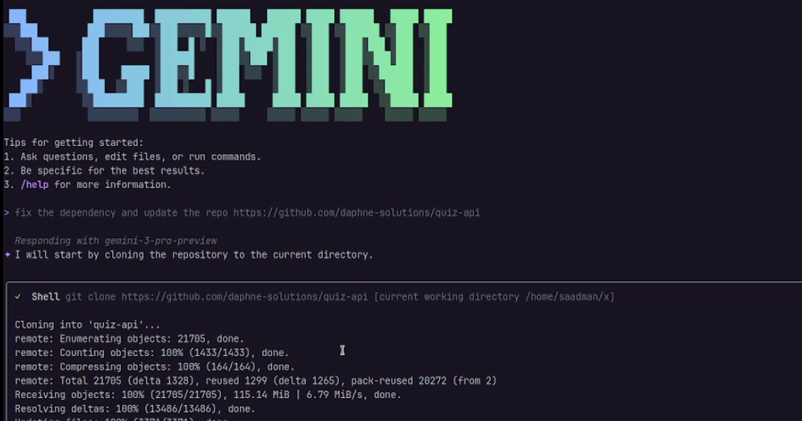

# UV-mcp MCP Server

[](https://geminicli.com/extensions)


[](https://www.youtube.com/watch?v=Tv2dUt73mM8) 

A Model Context Protocol (MCP) server for `uv` - the fast Python package manager. UV-mcp provides environment diagnostics, repair capabilities, and dependency management through a Gemini CLI extension.

## Features

UV-mcp exposes 5 powerful tools for managing Python environments:

### **check_uv_installation**
Check if `uv` is installed and get version information.

### **install_uv**
Get platform-specific installation instructions for `uv`.

### **diagnose_environment**
Comprehensive environment health check that analyzes:
- uv installation and version
- Project structure (pyproject.toml, requirements.txt)
- Virtual environment status
- Dependency health and conflicts
- Python version compatibility
- Lockfile presence

### **repair_environment**
Automatically fix common environment issues:
- Create virtual environment if missing
- Initialize new project with pyproject.toml
- Sync dependencies from lockfile
- Update outdated packages
- Install missing Python interpreter

### **add_dependency**
Add new dependencies to your project:
- Supports version specifications
- Development dependencies
- Optional dependency groups
- Automatic pyproject.toml and lockfile updates

### **remove_dependency**
Remove dependencies from your project:
- Removes from pyproject.toml
- Updates lockfile
- Uninstalls from virtual environment

## Installation

### Prerequisites

1. **Python 3.10 or higher**

2. **`uv` package manager** - Install it first:
   ```bash
   # Linux/macOS
   curl -LsSf https://astral.sh/uv/install.sh | sh
   
   # Windows
   powershell -c "irm https://astral.sh/uv/install.ps1 | iex"
   
   # Or via pip
   pip install uv
   ```
   
   Verify installation:
   ```bash
   uv --version
   ```

3. **Gemini CLI** - Required for extension installation

### Install from GitHub (Recommended)

```bash
# Install the latest stable version
gemini extensions install https://github.com/saadmanrafat/uv-mcp

# Install a specific version
gemini extensions install https://github.com/saadmanrafat/uv-mcp --ref=v0.3.0

# Install development version
gemini extensions install https://github.com/saadmanrafat/uv-mcp --ref=dev
```

After installation, restart your Gemini CLI session to activate the extension.

### Install from Local Directory (Development)

```bash
# Clone the repository
git clone https://github.com/saadmanrafat/uv-mcp
cd uv-mcp

# Install dependencies
uv sync

# Link for development
gemini extensions link .
```

## Usage

### Running the Server

The server runs in stdio mode for MCP communication:

```bash
uv run uv-mcp
```

### Configuration for Claude Desktop / Claude Code

UV-mcp works with both **Claude Desktop** and **Claude Code**. Choose your preferred configuration method:

#### Option 1: Using Claude Code CLI (Recommended)

If you have Claude Code installed, you can add the MCP server using the CLI:

```bash
# Add uv-mcp server globally (available in all projects)
claude mcp add uv-mcp --scope user -- uv --directory /path/to/uv-mcp run uv-mcp

# Or add for current project only
claude mcp add uv-mcp --scope project -- uv --directory /path/to/uv-mcp run uv-mcp
```

Verify the server was added:
```bash
claude mcp list
```

To remove the server:
```bash
claude mcp remove uv-mcp
```

#### Option 2: Manual Configuration File

Add this configuration to your Claude Desktop/Code config file:

**Config file locations:**
- **macOS**: `~/Library/Application Support/Claude/claude_desktop_config.json`
- **Windows**: `%APPDATA%\Claude\claude_desktop_config.json`
- **Linux**: `~/.config/Claude/claude_desktop_config.json`

```json
{
  "mcpServers": {
    "uv-mcp": {
      "command": "uv",
      "args": [
        "--directory",
        "/path/to/uv-mcp",
        "run",
        "uv-mcp"
      ]
    }
  }
}
```

> **Note:** Replace `/path/to/uv-mcp` with the actual path where you cloned or installed uv-mcp.

### Configuration for Gemini CLI Extension

UV-mcp can be installed as a Gemini CLI extension for seamless integration.

#### Install as Extension

```bash
# Navigate to the UV-mcp directory
cd /path/to/uv-mcp

# Link the extension to Gemini CLI
gemini extensions link .
```

After linking, restart your Gemini CLI session. The UV-mcp tools will be automatically available.

#### Uninstall Extension

```bash
# Unlink the extension
gemini extensions unlink uv-mcp
```

#### Manual Configuration (Alternative)

If you prefer manual configuration, add this to your Gemini settings:

```json
{
  "mcpServers": {
    "uv-mcp": {
      "command": "uv",
      "args": [
        "--directory",
        "/path/to/uv-mcp",
        "run",
        "uv-mcp"
      ]
    }
  }
}
```

> **Note:** Replace `/path/to/uv-mcp` with the actual path to your uv-mcp installation.

## Example Workflows

### Diagnosing a Project

Ask your LLM:
> "Use uv-mcp to diagnose my Python environment"

The mcp will:
1. Check if uv is installed
2. Analyze project structure
3. Check dependencies for conflicts
4. Validate Python version
5. Report virtual environment status

### Repairing an Environment

Ask your LLM:
> "My Python environment is broken. Can you fix it?"

The mcp will:
1. Create a virtual environment if needed
2. Initialize pyproject.toml if missing
3. Sync all dependencies
4. Report all actions taken

### Adding Dependencies

Ask your LLM:
> "Add requests and pytest as a dev dependency to my project"

The mcp will:
1. Add requests to dependencies
2. Add pytest to dev dependencies
3. Update pyproject.toml
4. Update lockfile

## Tool Reference

### check_uv_installation()

Returns JSON with:
```json
{
  "installed": true,
  "version": "uv 0.5.0",
  "message": "✓ uv is installed: uv 0.5.0"
}
```

### install_uv()

Returns installation instructions for all platforms.

### diagnose_environment(project_path: Optional[str] = None)

**Parameters:**
- `project_path`: Path to project directory (optional, defaults to current directory)

**Returns:** Comprehensive diagnostic report with health status, issues, and warnings.

### repair_environment(project_path: Optional[str] = None, auto_fix: bool = True)

**Parameters:**
- `project_path`: Path to project directory (optional)
- `auto_fix`: Whether to automatically apply fixes (default: True)

**Returns:** List of actions taken and their results.

### add_dependency(package: str, project_path: Optional[str] = None, dev: bool = False, optional: Optional[str] = None)

**Parameters:**
- `package`: Package name with optional version (e.g., "requests>=2.28.0")
- `project_path`: Path to project directory (optional)
- `dev`: Add as development dependency (default: False)
- `optional`: Optional dependency group name (e.g., "test", "docs")

**Returns:** Operation result with success status and output.

### remove_dependency(package: str, project_path: Optional[str] = None, dev: bool = False, optional: Optional[str] = None)

**Parameters:**
- `package`: Package name (e.g., "requests")
- `project_path`: Path to project directory (optional)
- `dev`: Remove from development dependencies (default: False)
- `optional`: Optional dependency group name

**Returns:** Operation result with success status and output.

## Development

### Project Structure

```
uv-mcp/
├── src/
│   └── uv_mcp/
│       ├── __init__.py
│       ├── server.py          # Main MCP server
│       ├── uv_utils.py        # uv command utilities
│       └── diagnostics.py     # Environment diagnostics
├── tests/
│   ├── __init__.py
│   └── test_uv_mcp.py         # Comprehensive pytest test suite
├── gemini-extension.json      # Gemini CLI extension manifest
├── GEMINI.md                  # Extension instructions for AI
├── pyproject.toml
├── Dockerfile                 # Multi-stage Docker build
├── docker-compose.yml         # Docker Compose configuration
├── pytest.ini                 # Pytest configuration
├── test_tools.py              # Quick verification tests
└── README.md
```

### Testing

```bash
# Run comprehensive test suite with pytest
uv run pytest tests/ -v

# Run with coverage report
uv run pytest tests/ --cov=uv_mcp --cov-report=html

# Quick verification tests
uv run python test_tools.py

# Test uv detection
uv run python -c "from uv_mcp.uv_utils import check_uv_available; print(check_uv_available())"

# Test with MCP Inspector (if available)
npx @modelcontextprotocol/inspector uv run uv-mcp
```

### Docker

Build and run with Docker:

```bash
# Build the image
docker build -t uv-mcp .

# Run the container
docker run -it uv-mcp

# Using Docker Compose
docker-compose up -d uv-mcp

# Run tests in Docker
docker-compose --profile testing run test
```

## Troubleshooting

### uv not found

If the server reports that `uv` is not installed:

1. Use the `install_uv` tool to get installation instructions
2. Install uv using your preferred method
3. Verify with `uv --version`

### Permission errors

If you encounter permission errors when creating virtual environments:

```bash
# Ensure you have write permissions in the project directory
chmod +w /path/to/project
```

### Import errors

If you see import errors for `tomllib`:

- Python 3.11+: `tomllib` is built-in
- Python 3.10: Install `tomli`: `uv add tomli`

## Contributing

Contributions are welcome! Please see [CONTRIBUTING.md](CONTRIBUTING.md) for guidelines.

### Quick Start for Contributors

1. Fork the repository
2. Create a feature branch
3. Make your changes
4. Run tests: `uv run python test_tools.py`
5. Submit a pull request

## License

MIT License - feel free to use and modify as needed.

## Contributing

Contributions are welcome! Please feel free to submit issues or pull requests.

## Links

- [uv Documentation](https://docs.astral.sh/uv/)
- [Model Context Protocol](https://modelcontextprotocol.io/)
- [FastMCP](https://gofastmcp.com/)
- [Gemini CLI Extensions](https://geminicli.com/docs/extensions/getting-started-extensions/)
