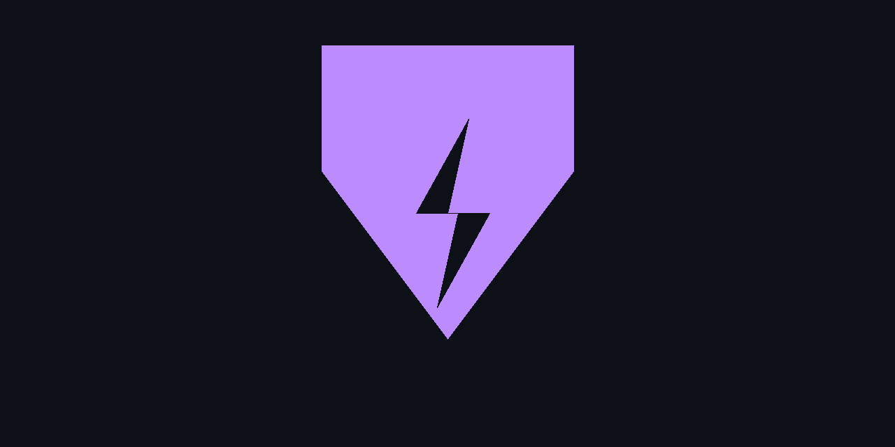

# uv-mcp 

[](https://geminicli.com/extensions)


[](LICENSE)


A Model Context Protocol (MCP) server for `uv` - the fast Python package manager. `uv-mcp` provides environment diagnostics, repair capabilities, and dependency management through a Gemini CLI extension.

---



## Why uv-mcp?

### **Built for Modern Python**
- **Native uv integration** - Works seamlessly with uv.lock and pyproject.toml
- **PEP 668 compliant** - Respects externally-managed-environment restrictions
- **No global pollution** - All operations scoped to project environments

### **AI-Native Design**
- **MCP protocol** - Works with Claude Desktop, Claude Code, Gemini CLI
- **Natural language** - No command syntax to memorize
- **Context-aware** - Understands your project structure automatically

### **Production-Ready**
- **Deterministic** - Same diagnosis and fixes across all machines
- **CI/CD friendly** - Works in containers and managed environments
- **Auditable** - Clear logs of every operation

---

## Quick Start

### Installation

**For Gemini CLI** (Recommended):
```bash
gemini extensions install https://github.com/saadmanrafat/uv-mcp
```

**For Claude Desktop/Code**:
```bash
claude mcp add uv-mcp -- uv --directory /path/to/uv-mcp run uv-mcp
```

More installation options in the [full documentation](https://saadman.dev/uv-mcp/)

---

## Links

- **Documentation**: https://saadman.dev/uv-mcp/
- **GitHub**: https://github.com/saadmanrafat/uv-mcp
- **Demo Video**: https://www.youtube.com/watch?v=Tv2dUt73mM8
- **Featured On**: https://geminicli.com/extensions
- **uv Docs**: https://docs.astral.sh/uv/
- **MCP Spec**: https://modelcontextprotocol.io/

---

##  Community & Support

- **Issues**: [GitHub Issues](https://github.com/saadmanrafat/uv-mcp/issues)
- **Twitter/X**: [@saadmanrafat](https://twitter.com/saadmanrafat_)

---

<div align="center">

**Built by [Saadman Rafat](https://github.com/saadmanrafat)**


[Install Now](https://saadman.dev/uv-mcp/guides/installation/#installation) • [Read Docs](https://saadman.dev/uv-mcp/) • [Watch Demo](https://www.youtube.com/watch?v=Tv2dUt73mM8)

</div>
